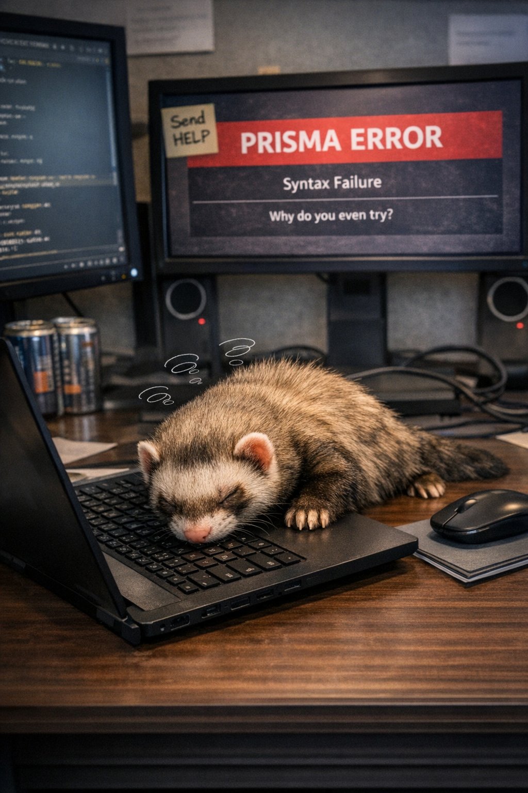

# ORMs: Humanity’s Greatest Invention or a Crime Against Databases?

Object‑Relational Mappers (ORMs) promise to make database queries easier.  
And they do — in the same way microwaving a steak makes cooking easier.

## The Good  

- You write less SQL  
- You avoid typos  
- You feel powerful

## The Bad  

- Performance? Never heard of her  
- Debugging generated queries is like reading ancient runes  
- Every ORM has at least one feature that exists purely to ruin your day

## The Verdict  

Great for beginners.  
Great for prototypes.  
Terrifying in production.

Scrimshaw tried Prisma once.  
He’s still recovering.

